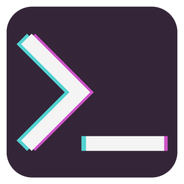

  
   
  <strong>La MuXeD web</strong> 💻 Una web experimental de cojones 💻  
    ⌨️ con ❤︎ por
      <a href="https://github.com/juananmuxed">MuXeD</a>
      
    
    
    

### 🤔 ¿Qué es esto?
El repositorio de mi portfolio, eso es todo.

### 📂 Dependencias
- [Vue](https://vuejs.org/)
- [Vuex](https://vuex.vuejs.org/)
- [Vue-router](https://router.vuejs.org/)

### 💡 Recursos
- [Tipografía de la consola](https://int10h.org/oldschool-pc-fonts/)

### 📌 Versiones
Uso [SemVer](http://semver.org/) para las versiones. Para todas las versiones disponibles, mira los [tags en este repositorio](https://github.com/juananmuxed/muxed/tags).

### ✒️ Autor

**MuXeD** a.k.a **Juanan** - *Trabajo Inicial* - [muxed.es](https://muxed.es/)

### 📄 Licencia

Este proyecto está bajo la Licencia (MIT) - mira el archivo [LICENSE.md](LICENSE.md) para detalles

### 🎁 Donaciones
Comprame café

